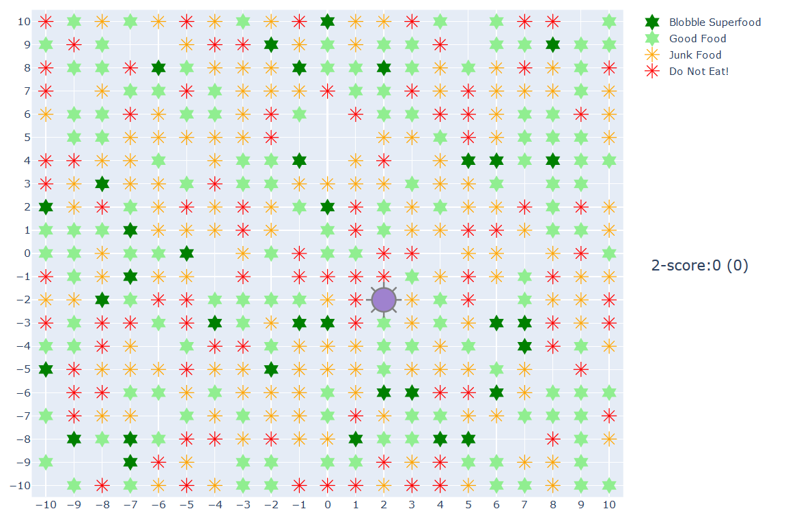

# blobble-world

Blobble World is an AI environment for experimenting with reinforcement 
learning.

It's silly and created purely for fun.



The blobble (in purple) can move around its world by taking one step on each turn (north, south, east, west). Before
it moves, it can eat the food at its current location (if it deems it tasty).

There are four types of food ranging from very unhealthy to super-food. The better the food, the healthier (bigger) the
blobble becomes.

The blobble can learn how to stay healthy and therefore survive longer. It can have the following 'senses':

* tasting blobble - able to taste the food at the current location before eating. A tasting blobble soon learns to 
eat the good stuff and leave the bad stuff.

* smelling blobble - able to 'smell' food in each direction. A smelling blobble should learn to move towards good food.

## AI Gym Environment

### Observations
```
        Type: Box(3)
        Num     Observation                             Min             Max
        0       Blobble X location                      MIN_LOC(-10)    MAX_LOC (10)
        1       Blobble Y location                      MIN_LOC(-10)    MAX_LOC (10)
        2       Health                                  0               MAX_HEALTH (10)
        3       Taste (Food nutritional value at loc)   -5              +5     (set to zero if no food)
        4       Food smell north                        -10             +10
        5       Food smell south                        -10             +10
        6       Food smell east                         -10             +10
        7       Food smell west                         -10             +10
```
### Actions
```

    Action
        Type: Discrete(10)
        Num     Action
        0       eat
        1       eat, move E
        2       eat, move S
        3       eat, move W
        4       eat, move N
        5       move E
        6       move S
        7       move W
        8       move N
```
### An Episode Ends When
```
 - The blobble's health goes below zero
```

### Rewards

```
 - 0.5 for every step
        - extra 0.5 for being over average health (encourage healthy eating)
```


## Running the Code

From within an Anaconda command prompt, navigate to this cloned repository to create 
a virtual environment.

```
conda env create -f blobble-world-gpu.yml
conda activate blobble-world
```

For non-gpu execution, reinstall tensorflow:

```
conda install tensorflow
```

The AI Gym environment must be built and installed.

From the cloned repo folder:

```
pip install -e .
```

Then, within python (or notebook):

```
import gym
gym.make('gym_blobble:blobble-world-v0')
```

See details [here](https://github.com/openai/gym/blob/master/docs/creating-environments.md).


