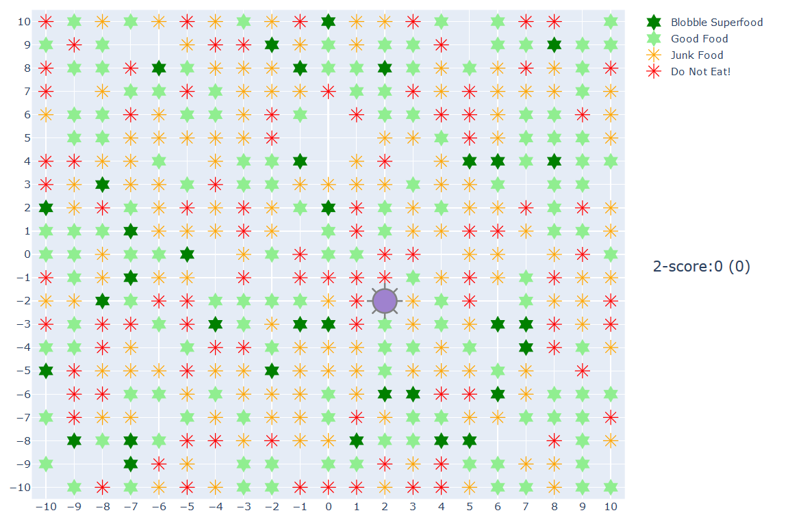
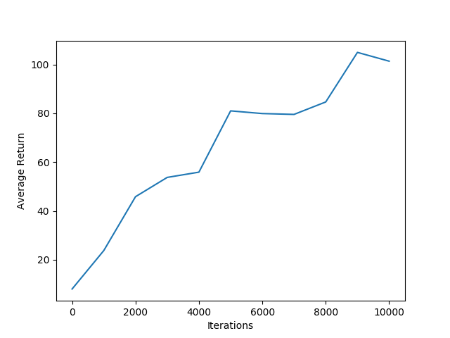
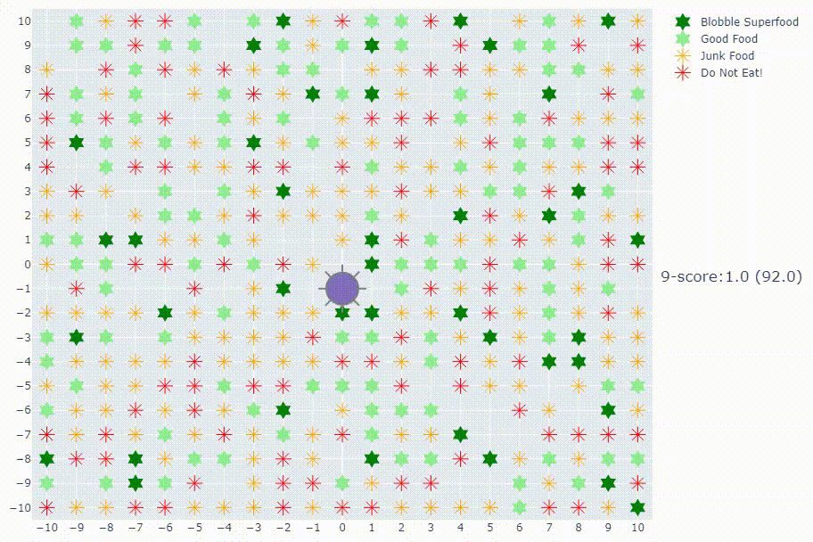
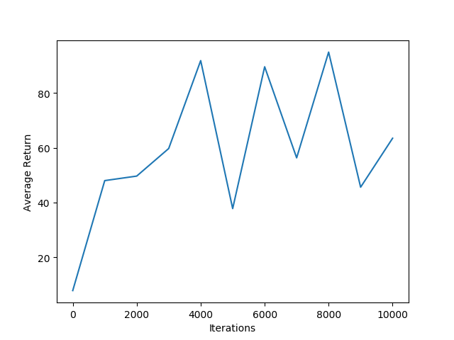
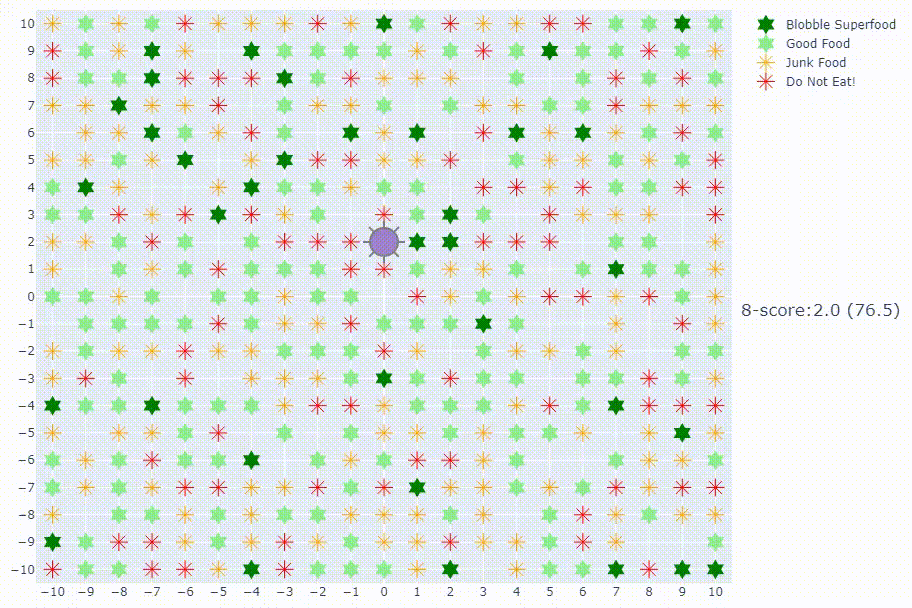
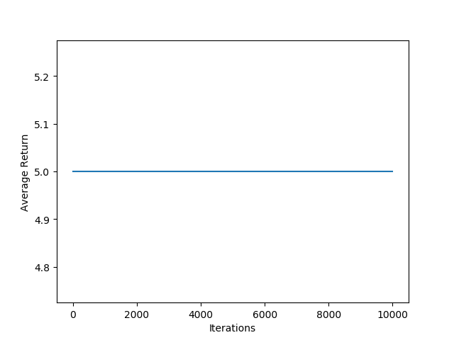
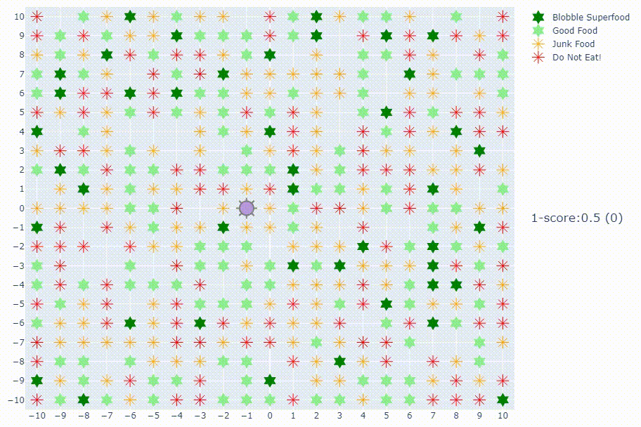

# blobble-life

**New for 2021 - Blobbles have better noses!**
(note that the description below hasn't yet been updated for better smelling capability)

Blobble Life is an AI environment for experimenting with reinforcement 
learning.

It's silly and created purely for fun.



The blobble (in purple) can move around its world by taking one step on each turn (north, south, east, west). Before
it moves, it can eat the food at its current location (if it deems it tasty).

There are four types of food ranging from very unhealthy to super-food. The better the food, the healthier (bigger) the
blobble becomes.

The blobble can learn how to stay healthy and therefore survive longer. It can have the following 'senses':

* tasting blobble - able to taste the food at the current location before eating. A tasting blobble soon learns to 
eat the good stuff and leave the bad stuff.

* smelling blobble - able to 'smell' food in each direction. A smelling blobble should learn to move towards good food.
The blobble can smell food up to 5 steps away, but food closer smells stronger. The blobble cannot 
smell the food it's on top of. 
In the current implementation,
blobble just smells all food on a single range of food smelliness - where food with little nutrition 
is negative on the scale. Future implementations might have different types of smell.

## AI Gym Environment

### Observations
```
        Type: Box(3)
        Num     Observation                             Min             Max
        0       Blobble X location                      MIN_LOC(-10)    MAX_LOC (10)
        1       Blobble Y location                      MIN_LOC(-10)    MAX_LOC (10)
        2       Health                                  0               MAX_HEALTH (10)
        3       Taste (Food nutritional value at loc)   -5              +5     (set to zero if no food)
        4       Food smell north                        -10             +10
        5       Food smell south                        -10             +10
        6       Food smell east                         -10             +10
        7       Food smell west                         -10             +10
```
### Actions
```

    Action
        Type: Discrete(10)
        Num     Action
        0       eat
        1       eat, move E
        2       eat, move S
        3       eat, move W
        4       eat, move N
        5       move E
        6       move S
        7       move W
        8       move N
```
### An Episode Ends When
```
 - The blobble's health goes below zero
```

### Rewards

```
 - 0.5 for every step
        - extra 0.5 for being over average health (encourage healthy eating)
```

## Learning Results
The following experiments used a QNetwork agent with:

```
shape = (75,40)
learning rate = 1e-3
learming iterations = 10,000
```

### Tasting and Smelling Blobble 
Here's average return during learning when the blobble has taste and smell:



The video of the resulting blobble agent running over 10 episodes (trimmed to reduce size):



Running this agent over 10 episodes, the maximum score it 
gets is 134.5. 

The blobble occasionally misses eating good food - it may be that it requires longer learning to cater for the 
more complex observations.

The blobble sometimes gets in a 'rut' and repeats its behaviour leading to its 
demise. Perhaps next step is to have an exploratory aspect to the 
blobble to add some occasional randomness.

### Tasting only Blobble
Here's the average return for the blobble learning with taste only:



Running this agent without the smell, maximum 
score drops to 90. As you would expect, the blobble moves randomly but has learned to only eat good food.

The video of the resulting blobble agent running over 10 episodes (trimmed to the last few to make it smaller):



### Smelling only Blobble

Is it better for the blobble to smell or taste? Here's what happens when the blobble can only smell.



Essentially, the blobble agent fails to learn and performs randomly. 

The video of the resulting blobble agent running over 10 episodes:



### Random Blobble

And, for completemess, when the blobble returns no smell or taste information, obviously the result is random. 


## Running the Code

From within an Anaconda command prompt, navigate to this cloned repository to create 
a virtual environment.

```
conda env create -f blobble-life-gpu.yml
conda activate blobble-life
```

For non-gpu execution, reinstall tensorflow:

```
conda install tensorflow
```

The AI Gym environment must be built and installed.

From the cloned repo folder:

```
pip install -e .
```

Then, within python (or notebook):

```
import gym
gym.make('gym_blobble:blobble-life-v0')
```

See details [here](https://github.com/openai/gym/blob/master/docs/creating-environments.md).

To run the code:

```
   agent = QNetworkAgent('blobble-life-v0')
   agent.run_agent(...)
```

```run_agent``` takes several parameters. Take a look in ```LearningBlobble.py``` for an example of the code above.

The training step can be changed by updating the ```train_neural_network``` function's default parameters in the 
same file. (To do: I will update to make this easier - using a configuration file).


 


